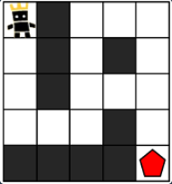
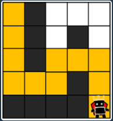
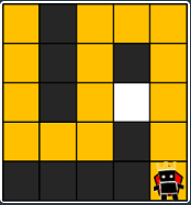
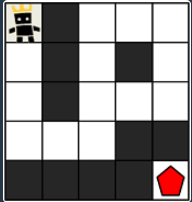

# [게임 맵 최단 거리⭐⭐]

**[문제 URL - https://school.programmers.co.kr/learn/courses/30/lessons/1844]**

-   권장시간 60분
-   권장 시간 복잡도 O(N\*M)

## 문제 설명

> ROR 게임은 두 팀으로 나누어서 진행하며, 상대 팀 진영을 먼저 파괴하면 이기는 게임입니다. 따라서, 각 팀은 상대 팀 진영에 최대한 빨리 도착하는 것이 유리합니다.
> 지금부터 당신은 한 팀의 팀원이 되어 게임을 진행하려고 합니다. 다음은 5 x 5 크기의 맵에, 당신의 캐릭터가 (행: 1, 열: 1) 위치에 있고, 상대 팀 진영은 (행: 5, 열: 5) 위치에 있는 경우의 예시입니다.



> 위 그림에서 검은색 부분은 벽으로 막혀있어 갈 수 없는 길이며, 흰색 부분은 갈 수 있는 길입니다. 캐릭터가 움직일 때는 동, 서, 남, 북 방향으로 한 칸씩 이동하며, 게임 맵을 벗어난 길은 갈 수 없습니다.
> 아래 예시는 캐릭터가 상대 팀 진영으로 가는 두 가지 방법을 나타내고 있습니다.

> 첫 번째 방법은 11개의 칸을 지나서 상대 팀 진영에 도착했습니다.



> 두 번째 방법은 15개의 칸을 지나서 상대팀 진영에 도착했습니다.



> 위 예시에서는 첫 번째 방법보다 더 빠르게 상대팀 진영에 도착하는 방법은 없으므로, 이 방법이 상대 팀 진영으로 가는 가장 빠른 방법입니다.
> 만약, 상대 팀이 자신의 팀 진영 주위에 벽을 세워두었다면 상대 팀 진영에 도착하지 못할 수도 있습니다. 예를 들어, 다음과 같은 경우에 당신의 캐릭터는 상대 팀 진영에 도착할 수 없습니다.



> 게임 맵의 상태 maps가 매개변수로 주어질 때, 캐릭터가 상대 팀 진영에 도착하기 위해서 지나가야 하는 칸의 개수의 최솟값을 return 하도록 solution 함수를 완성해주세요. 단, 상대 팀 진영에 도착할 수 없을 때는 -1을 return 해주세요.

## 제약 조건

-   maps는 n x m 크기의 게임 맵의 상태가 들어있는 2차원 배열로, n과 m은 각각 1 이상 100 이하의 자연수입니다.
    -   n과 m은 서로 같을 수도, 다를 수도 있지만, n과 m이 모두 1인 경우는 입력으로 주어지지 않습니다.
-   maps는 0과 1로만 이루어져 있으며, 0은 벽이 있는 자리, 1은 벽이 없는 자리를 나타냅니다.
-   처음에 캐릭터는 게임 맵의 좌측 상단인 (1, 1) 위치에 있으며, 상대방 진영은 게임 맵의 우측 하단인 (n, m) 위치에 있습니다.

## 예제 입/출력

### 예제1

**입력**

`[[1,0,1,1,1],[1,0,1,0,1],[1,0,1,1,1],[1,1,1,0,1],[0,0,0,0,1]]`

**출력**

`11`

### 예제2

**입력**

`[[1,0,1,1,1],[1,0,1,0,1],[1,0,1,1,1],[1,1,1,0,0],[0,0,0,0,1]]`

**출력**

`-1`

## 접근 방식

### 시간 복잡도

-   **[최대 시간 복잡도 : O(N*M)]**
-   맵의 세로길이, 가로길이만큼 순회하여 방문하기때문

### 자료구조

-   **[사용한 자료구조 : 큐, 배열]**

### 알고리즘

-   **[사용한 알고리즘 : BFS]**
-   최단경로를 찾기위해 BFS 알고리즘 사용

## 소스 코드

```javascript
function solution(maps) {
    /*
        maps = [
            [1, 0, 1, 1, 1],
            [1, 0, 1, 0, 1],
            [1, 0, 1, 1, 1],
            [1, 1, 1, 0, 1],
            [0, 0, 0, 0, 1]
        ];
    */

    let n = maps[0].length; // 맵의 가로길이
    let m = maps.length; // 맵의 세로길이
    let directions = [
        [0, 1],
        [1, 0],
        [0, -1],
        [-1, 0],
    ]; // 방향

    let queue = [[0, 0, 1]]; // x좌표, y좌표, 이동거리

    // 방문한 좌표 체크용
    let visited = new Array(m).fill(null).map(() => new Array(n).fill(false));

    while (queue.length) {
        let [x, y, distance] = queue.shift();
        // 도착하면 반환
        if (x == n - 1 && y == m - 1) return distance;

        for (const [direcX, direcY] of directions) {
            let nx = x + direcX;
            let ny = y + direcY;

            // 맵을 벗어나는지 체크
            if (
                nx < 0 ||
                ny < 0 ||
                nx >= n ||
                ny >= m ||
                maps[ny][nx] == 0 ||
                visited[ny][nx]
            ) {
                continue;
            }

            // 새로운 이동경로를 큐에 추가
            queue.push([nx, ny, distance + 1]);
            visited[ny][nx] = true;
        }
    }

    return -1;
}
```

## 수정하기전 소스 코드

```javascript
function solution(maps) {
    // Set 을 사용해서 방문기록 체크하니, 효율성 테스트 시간초과 발생..

    /*
        maps = [
            [1, 0, 1, 1, 1],
            [1, 0, 1, 0, 1],
            [1, 0, 1, 1, 1],
            [1, 1, 1, 0, 1],
            [0, 0, 0, 0, 1]
        ];
    */

    let n = maps[0].length; // 맵의 가로길이
    let m = maps.length; // 맵의 세로길이
    let directions = [
        [0, 1],
        [1, 0],
        [0, -1],
        [-1, 0],
    ]; // 방향

    let queue = [[0, 0, 1]]; // x좌표, y좌표, 이동거리

    // 방문한 좌표 체크용
    let visited = new Set();

    while (queue.length) {
        let [x, y, distance] = queue.shift();
        // 도착하면 반환
        if (x == n - 1 && y == m - 1) return distance;

        for (const [direcX, direcY] of directions) {
            let nx = x + direcX;
            let ny = y + direcY;

            // 맵을 벗어나는지 체크
            if (
                nx < 0 ||
                ny < 0 ||
                nx >= n ||
                ny >= m ||
                maps[ny][nx] == 0 ||
                visited.has(`${ny},${nx}`)
            ) {
                continue;
            }

            // 새로운 이동경로를 큐에 추가
            queue.push([nx, ny, distance + 1]);
            visited.add(`${ny},${nx}`);
        }
    }

    return -1;
}
```
